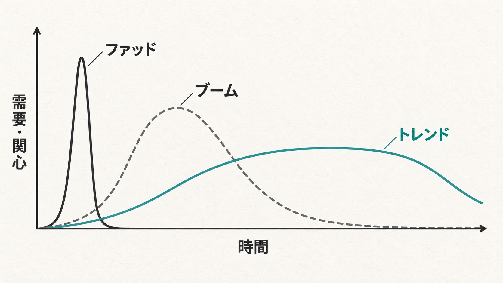

どーも！とーるです！

「あの人がやってたやり方、そのまま真似したんですけど、全然売れませんでした」

これ、相談でよく聞きます。

商品も似せた。価格も合わせた。発信の内容も、かなり寄せた。

なのに売れない。

そうすると、だいたいこう思うんですよね。

「自分のやり方が下手だったのかな」

いや、たぶんそこじゃないです。

> **入った時期が、違うんです。**

## プロダクトライフサイクル——商品には、寿命があります

マーケティングに**プロダクトライフサイクル**という考え方があります。

商品には、導入期・成長期・成熟期・衰退期という流れがある、というやつです。

導入期は、まだ誰も知らない。成長期で、一気に広まる。

成熟期になると、競合が増えて価格競争が始まる。そして衰退期で、静かに終わっていく。

どんな商品にも、この波があります。

で、この波が**やたら短い**タイプがあるんです。

マーケティングでは**ファッド**と呼ばれます。一気に盛り上がって、一気に引いていく流行のこと。

一気に流行って、気づいたら見かけなくなるもの。思い当たるものが、いくつかあると思います。

## 映画も、一本の作品で見れば「短期間で売る」商品です

映画なんかも分かりやすいと思います。

もちろん、映画という市場自体がなくなる、という話じゃありません。

**一本の映画作品**で考えてみてください。

新作映画が公開された。CMを出す。俳優さんが番宣に出る。SNSでも予告が流れる。

公開初週。一気にお客さんを集める。

そして数週間、数か月で、上映はだんだん減っていく。

基本的には、同じ一本の映画を10年間ずっと映画館で売り続けよう、とは考えませんよね。

10年やってたら、それはもう名画座です（笑）

旬があるんです。

> **だから、その短いライフサイクルの中で、どれだけ大きな売上を作れるかが大事になる。**

そして一本終わったら、また次の作品。次が終わったら、また次。

これができます。

（ちなみに、何十年も同じ枠で戦い続けている作品もあります。サザエさんとか。あれはもう商品というより、気候ですね）

## SNSの世界も、まったく同じことが起きています

SNSでファッド売りが得意な人も、けっこうこれに近いです。

電子書籍が来る。Threadsが来る。動画生成が来る。新しい副業が来る。

需要が上がり始めたところで商品にする。一気に販売する。市場が盛り上がっている間に売る。

そして、需要が落ち始めたら、次の需要を探す。

これ、悪いことじゃありません。

> **むしろ、ファッド型の商品を扱うなら、かなり正しい戦い方だと思います。**

問題は、それを見た初心者が、「〇〇が儲かるらしいぞ！」と、**商品だけを見て**参入してしまうことです。

## 「儲かるらしい」で入ると、だいたい後ろ半分を踏む

例えば、電子書籍の出し方を教えている人が、半年で1000万円売った。

それを見て、「電子書籍ってそんな儲かるんだ！」となる。

自分も勉強する。商品を作る。販売を始める。

たしかに、最初は売れるかもしれません。

でも、その頃には最初に参入した人は、すでに次を見ています。

なぜなら、その人は**「電子書籍講座を一生売ろう」**としていたんじゃなく、「今ここに需要がある」を見ていたからです。

需要が上がる。

↓

商品化する。

↓

売る。

↓

競合が増える。

↓

市場が成熟する。

↓

価格競争が始まる。

↓

需要が落ち着く。

↓

次へ行く。

ここまで込みで、最初から見ている。

一方、後から「儲かるらしい」だけを聞いて入った人は、商品しか見ていません。

だから、売上が下降し始めたところで、

「あれ？」

「前はもっと売れてたらしいのに」

「こんなはずじゃなかった」

となる。

> **でも、先にいた人からすると、元々“こんなはず”なんです。**

ずっと右肩上がりになるなんて、最初から思っていない。

旬があることを知っている。終わることも込みで売っている。

だから、次の商品を準備しているんです。

## ファッド売りに必要なのは、当てる力より「降りる力」

ここを知らずに、「売れている商品＝これからも売れ続ける商品」だと思って参入すると、けっこう危ないです。

> **ファッド売りって、当てる力だけじゃなく、降りる力も必要なんですよね。**

いつ入るか。どのくらい売るか。いつ次へ行くか。

ここまで含めて戦略です。

しかも、この「降りる」がいちばん難しい。

売れた実績がある商品ほど、手放せなくなりますからね。人間、時間とお金をかけたものほど捨てられない生き物なので。

## 真似するなら、商品じゃなく「設計」のほうを見る

だから、一時的にものすごく売れている人を見たときも、

「この商品すごい！」だけじゃなく、

> **「この人、商品の寿命をどこまで想定して売っているんだろう？」**

まで見た方がいいと思っています。

同じ映画を、同じ日に公開した2社があったとして。

片方は「初週で回収して、次の作品の準備に入る」と決めている。

もう片方は「これが当たれば10年いける」と思っている。

売っているものは同じでも、やっている商売は別物です。

> **同じ商品を真似しただけでは、同じ商売にはならないんです。**
